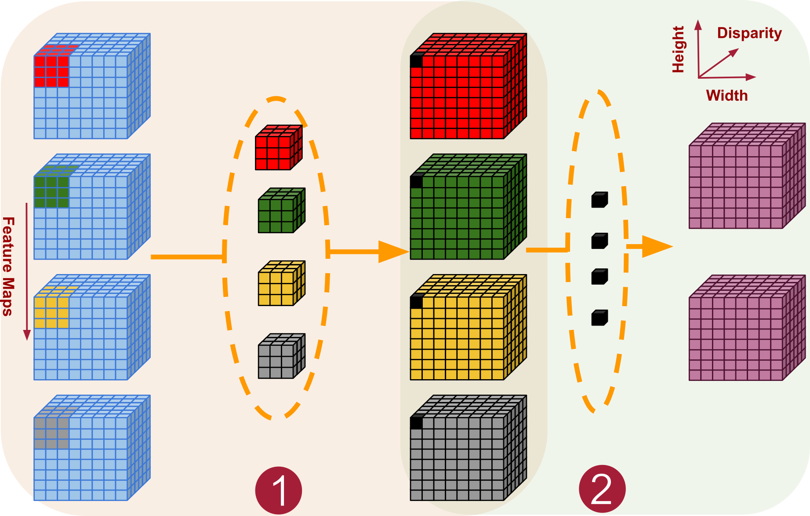
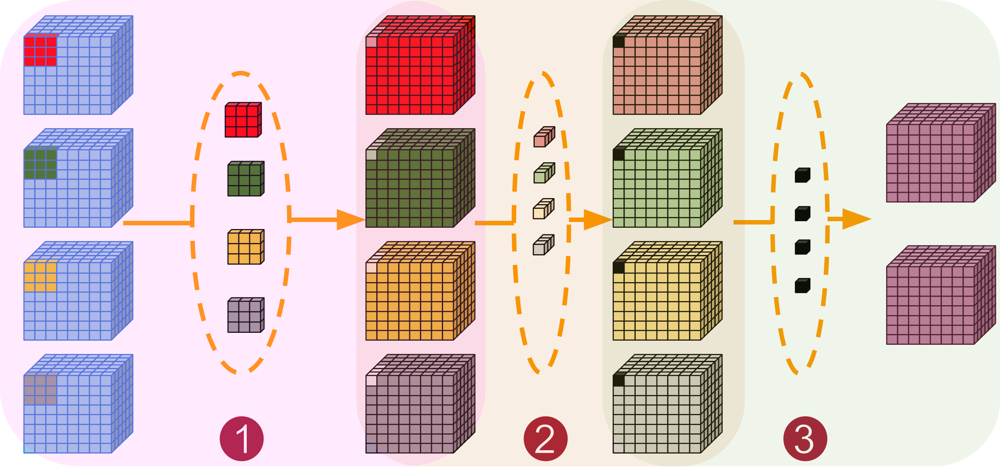
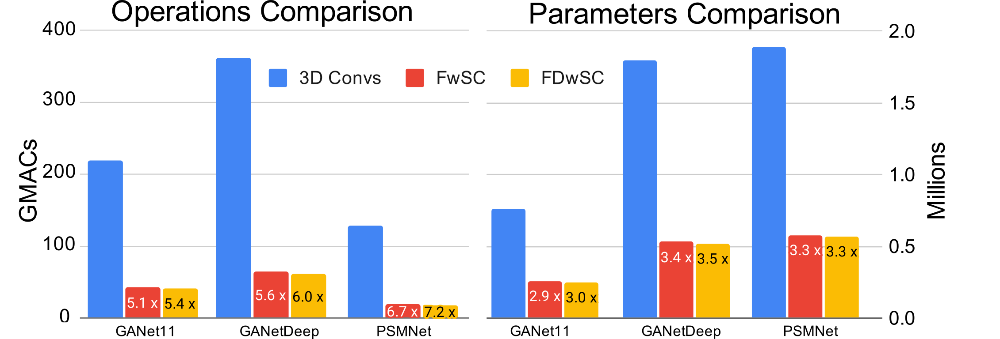
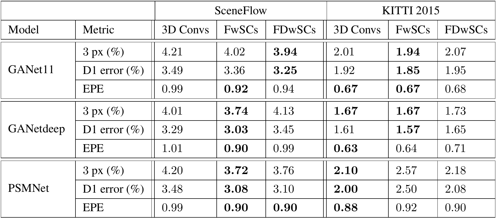

# Separable Convolutions for Optimizing 3D Stereo Networks

This repo contains the code
for "[Separable Convolutions for Optimizing 3D Stereo Networks](https://ieeexplore.ieee.org/document/9506330)" paper (IEEE ICIP 2021) by [Rafia Rahim](https://www.linkedin.com/in/rafiarahim/), Faranak Shamsafar and Andreas
Zell. [[arXiv](https://arxiv.org/abs/2108.10216)] [[project](https://uni-tuebingen.de/fakultaeten/mathematisch-naturwissenschaftliche-fakultaet/fachbereiche/informatik/lehrstuehle/kognitive-systeme/projects/deepstereovision/)] [[code](https://github.com/cogsys-tuebingen/separable-3D-convs-for-stereo-matching)] [[poster](https://drive.google.com/file/d/1OdKWDsOrKQQE24LXnHk6P6ODjgVJZ4Cv/view?usp=sharing)]

<div align="center">
    
    
    <p> <b> FwSC (left) and FDwSC (right) </b></p>
</div>

## Contents
  - [Introduction](#introduction)
  - [Example](#example)
  - [Experimentation Setup](#experimentation-setup)
    - [1. Conda environment setup:](#1-conda-environment-setup)
    - [2. Dataset Preparation:](#2-dataset-preparation)
    - [3. Train:](#3-train)
    - [4. Evaluate:](#4-evaluate)
    - [5. Predict:](#5-predict)
  - [Pre-trained Models](#pre-trained-models)
  - [Results](#results)
  - [Credits](#credits)
  - [Reference](#reference)

## Introduction

In this work we empirically show that 3D convolutions in stereo networks act as a major bottleneck. We propose a set of "plug-&-run" separable convolutions to reduce the computational load of 3D convolutions in stereo networks.

## Example

**How to use:**
One can simply plugin in our provided convolutions operators as replacements of 3D convolutions. Here we provide examples with detail computational costs.

```python
from conv_libs.separable_convolutions import FwSC, FDwSC

in_channel=32
out_channel=4
kernel_size=3

fwsc=  FwSC(in_channels=in_channel, out_channels=out_channel, kernel_size=kernel_size)

fdwsc=  FDwSC(in_channels=in_channel, out_channels=out_channel, kernel_size=kernel_size)
```

For the following sample input

```python
in_channel=32
out_channel=4
input_res=(in_channel, 48, 240, 528) 
kernel_size= (3,3,3)
```

`computational complexity` results are:

``` shell
For 3D convolution: flops=21.02 GMac and params=3.46 k

For Feature-wise separable convolution (FwSC) : flops=6.03 GMac and params=992, flops are 3.49x less than 3D conv

For Feature and Dispisparity-wise separable convolution (FwSC) : flops=3.11 GMac and params=512, flops are 6.76x less than 3D conv
```

For more details please refer to [this file](sample_computation_complexity.py).

## Experimentation Setup

### 1. Conda environment setup:

You can use the yaml files provided in networks sub-folders to setup the corresponding conda environments.

For GANet use [this yml file](networks/GANet/env_separable_convs_GANet.yml) and run following commands

```shell
conda env create -f env_separable_convs_GANet.yml
conda activate ganet
```

To work with PSMNet use [this file](networks/PSMNet/env_separable_convs_PSMNet.yml) and setup as follows:

```shell
conda env create -f env_separable_convs_PSMNet.yml
conda activate psmnet
```

### 2. Dataset Preparation:

Our dataset preparation code has been adapted from the baseline methods including [GANet](https://github.com/feihuzhang/GANet) and [PSMNet](https://github.com/JiaRenChang/PSMNet). To best visualize the folder hierarchy of datasets please refer to [DATA.md](Data.md).

### 3. Train:

Training / fine-tuning scripts for separable convolutions based networks can be found in following files:

- [Script for training GANet with separable convolutions](networks/GANet/train.sh)

- [Script for training PSMNet with separable convolutions](networks/PSMNet/train.sh)

For example to train `GANet11` model with `FwSC` we use following script

```shell
model=GANet11 #GANet11 or GANet_deep
conv_type=FwSC

cmd="train.py --data_path=/data2/rahim/data/
        --crop_height=240
        --crop_width=528
        --model=$model
        --convolution_type=$conv_type
        --nEpochs=15
        --training_list=./lists/sceneflow_train.list
        --val_list=./lists/sceneflow_val.list
        --max_disp=192
        --kitti2015=0"
python $cmd
```

### 4. Evaluate:

```shell
logdirs=FwSC_GANet11_kitti2015
resume=FwSC_GANet11_sceneflow_finetuned_kitti15.pth
cmd="evaluate.py --crop_height=384
            --crop_width=1248
            --max_disp=192
            --data_path=/data/rahim/data/Kitti_2015/training/
            --test_list=lists/kitti2015_val.list
            --save_path=./evaluation-results/${logdirs}
            --kitti2015=1
            --kitti=0
            --resume=./checkpoint/FwSC/$resume
            --model=GANet11
            --max_test_images=10
            --convolution_type=FwSC"
echo $cmd
python -W ignore $cmd >> ./logs/evaluate/${logdirs}.txt
```

Full scripts for evaluation can be found here:

- [GANet evaluation scripts](networks/GANet/evaluate.sh)

- [PSMNet evaluation scripts](networks/PSMNet/evaluate.sh)
  
### 5. Predict:

[Prediction script](networks/GANet/predict.sh) generates the results to upload on [KITTI benchmark](http://www.cvlibs.net/datasets/kitti/eval_scene_flow.php?benchmark=stereo) for evaluation.

## Pre-trained Models

We provide pretrained models with different configurations. Please download pre-trained models and place in the folders `./checkpoint/FwSC/` or `./checkpoint/FDwSC/` accordingly.

### GANet

<table>
    <thead>
        <tr>
            <th>Convolution Type</th>
            <th>Sceneflow Models</th>
            <th>Fintuned Models (kitti2015)</th>
        </tr>
    </thead>
    <tbody>
        <tr>
            <td rowspan=2>FwSC</td>
            <td><a href="https://drive.google.com/file/d/1WctFUDCzs0IWHkNFMi3QGwgBpBTaFVZZ/view?usp=sharing">FwSC_GANet11_sceneflow</a></td>
            <td><a href="https://drive.google.com/file/d/1WDpWLP2G5Z4YZPcXVphJArOpThWtub_L/view?usp=sharing">FwSC_GANet11_kitti2015</a></td>
        </tr>
        <tr>
            <td><a href="https://drive.google.com/file/d/16srWDodZCJJT1mvvvN-YEhVlV0JJd8St/view?usp=sharing">FwSC_GANetdeep_sceneflow</a></td>
            <td><a href="https://drive.google.com/file/d/1S_-cMtqJRmUQdT4cgdrO-Mvo7f-zXrmb/view?usp=sharing">FwSC_GANetdeep_kitti2015</a></td>
        </tr>
        <tr>
            <td rowspan=2>FDwSC</td>
            <td><a href="https://drive.google.com/file/d/1od-m9cSsM7dlyd7l7G_Zc5o3aiC7ExEe/view?usp=sharing"> FDwSC_GANet11_sceneflow</a> </td>
            <td><a href="https://drive.google.com/file/d/1CehEcmeYZ17okh1_IRY1Lz4Xjp606soe/view?usp=sharing">FDwSC_GANet11_kitti2015</a></td>
        </tr>
        <tr>
            <td><a href="https://drive.google.com/file/d/1GqNlfEVIHxR0aK0Ki0dvbBh9QABsYna-/view?usp=sharing"> FDwSC_GANetdeep_sceneflow</a></td>
            <td><a href="https://drive.google.com/file/d/17y3Fe-ICsUHGco0fKDrO1UlYjeZnbvR3/view?usp=sharing">FDwSC_GANetdeep_kitti2015</a></td>
        </tr>
    </tbody>
</table>

<!-- |Convolution Type |Sceneflow Models| Fintuned Models (kitti2015)|
|---|---|---|
|-|[FwSC_GANet11_sceneflow](https://drive.google.com/file/d/1WctFUDCzs0IWHkNFMi3QGwgBpBTaFVZZ/view?usp=sharing)| [FwSC_GANet11_kitti2015](https://drive.google.com/file/d/1WDpWLP2G5Z4YZPcXVphJArOpThWtub_L/view?usp=sharing)|
|-|[FwSC_GANetdeep_sceneflow](https://drive.google.com/file/d/16srWDodZCJJT1mvvvN-YEhVlV0JJd8St/view?usp=sharing)|[FwSC_GANetdeep_kitti2015](https://drive.google.com/file/d/1S_-cMtqJRmUQdT4cgdrO-Mvo7f-zXrmb/view?usp=sharing)|
|-|[FDwSC_GANet11_sceneflow](https://drive.google.com/file/d/1od-m9cSsM7dlyd7l7G_Zc5o3aiC7ExEe/view?usp=sharing)| [FDwSC_GANet11_kitti2015](https://drive.google.com/file/d/1CehEcmeYZ17okh1_IRY1Lz4Xjp606soe/view?usp=sharing)|
|-|[FDwSC_GANetdeep_sceneflow](https://drive.google.com/file/d/1GqNlfEVIHxR0aK0Ki0dvbBh9QABsYna-/view?usp=sharing)|[FDwSC_GANetdeep_kitti2015](https://drive.google.com/file/d/17y3Fe-ICsUHGco0fKDrO1UlYjeZnbvR3/view?usp=sharing)| -->

### PSMNet

|Convolution Type|Sceneflow Models| Fine-tuned Models (kitti2015)|
|---|---|---|
|FwSC|[FwSC_PSMNet_sceneflow](https://drive.google.com/file/d/1sx0eK1PjPS4yigpmTUOZtPmY5czazTwH/view?usp=sharing)| [FwSC_PSMNet_kitti2015](https://drive.google.com/file/d/1V78IBeB7_Gti2rk9ExOV_Jl2HwoI8tck/view?usp=sharing)|
|FDwSC|[FDwSC_PSMNet_sceneflow](https://drive.google.com/file/d/1ZCJxOliIKnUpHkHDhajkzuKe_L1WF6P_/view?usp=sharing)| [FDwSC_PSMNet_kitti2015](https://drive.google.com/file/d/1uMz_f_URVLG9eH4js0HThh0ma1Lz6M7u/view?usp=sharing)|

## Results

<!--  -->

<p align="center">

</p>

<p align="center">

</p>

<p align="center">

</p>

<p align="center"> <b> KITTI2015 results (left) and Sceneflow results (right) </b></p>

## Credits

This code is implemented based on [GANet](https://github.com/feihuzhang/GANet) and [PSMNet](https://github.com/JiaRenChang/PSMNet). Special thanks to authors of [DenseMatchingBenchmark](https://github.com/DeepMotionAIResearch/DenseMatchingBenchmark) for providing [evaluation](https://github.com/DeepMotionAIResearch/DenseMatchingBenchmark/blob/1026cc23cf78614dd0c0d6d8f63b532433ee9100/dmb/data/datasets/evaluation/stereo/pixel_error.py) and [visualization](https://github.com/DeepMotionAIResearch/DenseMatchingBenchmark/blob/c3b2b1d6cb526c328b278fd848cd85e08e301d81/dmb/visualization/stereo/vis.py) codes. We also want to thank authors of [ptflop counter](https://github.com/sovrasov/flops-counter.pytorch) for computational complexity code.

## Reference

If you find the code useful, please cite our paper:

```
@inproceedings{rahim2021separable,
    title={Separable Convolutions for Optimizing 3D Stereo Networks},
    author={Rahim, Rafia and Shamsafar, Faranak and Zell, Andreas},
    booktitle={2021 IEEE International Conference on Image Processing (ICIP)},
    pages={3208--3212},
    year={2021},
    organization={IEEE}
}
```